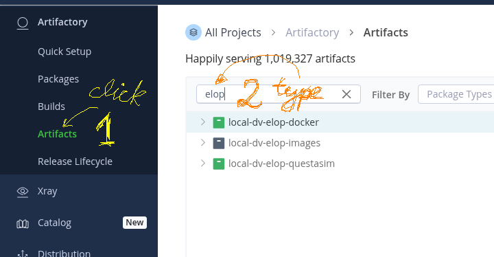
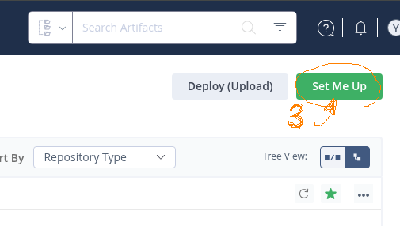
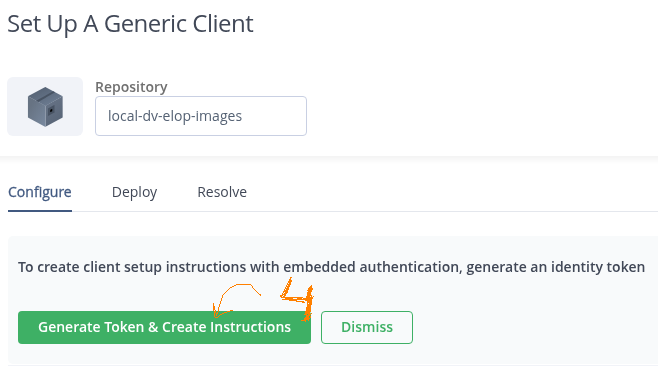
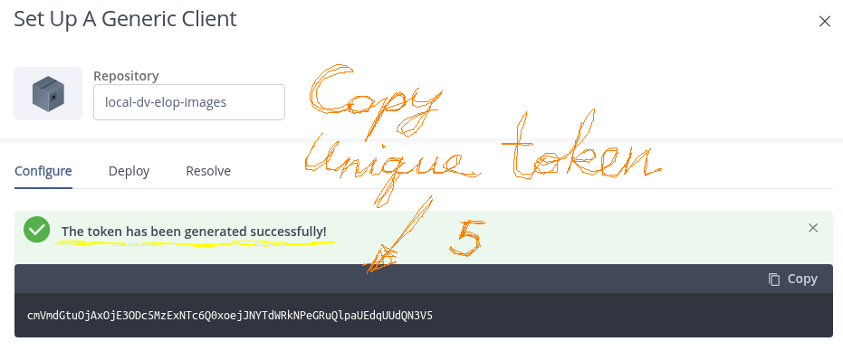

# Artifactory REST API — Starter Guide

## 1. Mental model

- Base URL: `https://<your-domain>/artifactory`
- Auth: Prefer Access Tokens (Authorization: Bearer …).
- Artifacts live in repos: generic-local, maven-local, docker-virtual, etc.
- Do with HTTP verbs: GET (read), PUT (upload), POST (actions/search), DELETE (delete).

>Tip for your env: if you have an on-prem/proxy URL, set `BASE="https://<your-artifactory-host>/artifactory"`
>and work from there. (Your Docker proxy path like .../.docker is not the REST base.)

## 2. Authentication

### 2.1. Generate your access authentication token

#### 2.1.1. Step 1 & 2: Find your artifacts' repository




#### 2.1.2. Step 3: Go to Set Me Up menu



#### 2.1.3. Step 4: Proceed to generate a unique token



#### 2.1.4. Step 5: Use your uniquely-generated token



### 2.2. Setup env-variables in your `~/.bashrc`
```bash
export TOKEN="eyJhbGciOi..."   # paste your token
export AUTHH="Authorization: Bearer $TOKEN"
export BASE="https://globalrepo.pe.jfrog.io"
```

## 3. Hello World: Who am I?

>By performing the next steps, you'll verify that our Artifactory Registry resides at `$BASE/artifactory`!
>Example: QuestaSim dockers will be at `$BASE/artifactory/local-dv-elop-docker`, while images
>at `$BASE/artifactory/local-dv-elop-images`

### 3.1 Run the next `curl` access

```bash
curl -sSI -H "$AUTHH" "$BASE/artifactory/api/system/version"
```

### 3.2 Check the STDOUT

You should be getting something of that sort. Search for `HTTP/1.1 200`,
where `200` is a code for successful access.

```test
HTTP/1.1 200 
Date: Thu, 28 Aug 2025 16:28:58 GMT
Content-Type: application/vnd.org.jfrog.artifactory.system.Version+json
Connection: keep-alive
X-JFrog-Version: Artifactory/7.120.3 712003900
X-Artifactory-Id: 71d76a7867799d3ad4712be288dd909b0fd645c7
X-Artifactory-Node-Id: a0misuow7xpvy-artifactory-primary-0
X-Request-ID: 1c3345ff8366ad3eded5e6f0440a5fb8:0123456789101114:0123456789101114:0
```

## 4. Upload & download artifacts

### 4.1. Upload a file

```bash
curl -T ~/Downloads/some-file.zip -H "$AUTHH" "$BASE/artifactory/local-dv-elop-images/some-file.zip"
```

The successful upload will have the next STDOUT:

```text
{
  "repo" : "local-dv-elop-images",
  "path" : "/some-file.zip",
  "created" : "2025-08-28T16:35:38.348Z",
  "createdBy" : "yehuda.tsimanis@elbitsystems.com",
  "downloadUri" : "https://globalrepo.pe.jfrog.io/artifactory/local-dv-elop-images/some-file.zip",
  "mimeType" : "application/octet-stream",
  "size" : "6916708",
  "checksums" : {
    "sha1" : "369e7eec842884faa4178f19ae5d79f1902813da",
    "md5" : "c3de25b57af38114ac38a13f75f73d50",
    "sha256" : "e03a57fdcfe13594cc654a708df98855dc30bdb90a36797d8c85f11e57c626cc"
  },
  "originalChecksums" : {
    "sha256" : "e03a57fdcfe13594cc654a708df98855dc30bdb90a36797d8c85f11e57c626cc"
  },
  "uri" : "https://globalrepo.pe.jfrog.io/artifactory/local-dv-elop-images/some-file.zip"
}
```

### 4.2. Download a file

```bash
curl -O -J -L -H "$AUTHH" "$BASE/artifactory/local-dv-elop-images/grey_1280x1024.txt"
```

The successful download will have the next STDOUT:

```text
  % Total    % Received % Xferd  Average Speed   Time    Time     Time  Current
                                 Dload  Upload   Total   Spent    Left  Speed
100 3839k  100 3839k    0     0  16.2M      0 --:--:-- --:--:-- --:--:-- 16.2M
curl: Saved to filename 'grey_1280x1024.txt'
```

### 4.3. Delete a file

>Don't try it, please :)

```bash
curl -X DELETE -H "$AUTHH" "$BASE/artifactory/local-dv-elop-images/i-dont-exist.txt"
```

## 5. Set & read properties (key-value metadata)

### 5.1. Set properties

Assuming we have `env` & `team` properties:

```bash
curl -X PUT -H "$AUTHH" "$BASE/artifactory/local-dv-elop-images/i-dont-exist.txt; env=prod; team=dv-elop"
```

### 5.2. Read properties

>FIXME: isn't working for me

```bash
curl -s -H "$AUTHH" "$BASE/artifactory/local-dv-elop-images/grey_1280x1024.txt"?properties" | jq .
```

## 6. Quick searches (no AQL)

### 6.1. Find by name (fuzzy)

```bash
curl -s -H "$AUTHH" \
 "$BASE/api/search/artifact?name=some-file.zip" | jq .
```

### 6.2. Find by property

```bash
curl -s -H "$AUTHH" \
 "$BASE/api/search/prop?env=prod" | jq .
```

## 7. AQL (Artifactory Query Language) — powerful search

### 7.1. Example 1: all ZIPs in a repo last 7 days

```bash
read -r -d '' AQL <<'EOF'
items.find({
 "repo": "generic-local",
 "name": {"$match":"*.zip"},
 "modified": {"$gt": "now-7d"}
}).include("name","repo","path","size","modified")
EOF
```
```bash
curl -s -H "$AUTHH" -H "Content-Type: text/plain" \
 -X POST "$BASE/api/search/aql" -d "$AQL" | jq .
```

### 7.2. Example 2: by property & size

```bash
read -r -d '' AQL <<'EOF'
items.find({
 "repo":"generic-local",
 "type":"file",
 "actual_md5":{"$exists":"true"},
 "@env":"prod",
 "size":{"$gt": 1048576}
}).include("repo","path","name","size","sha256","properties")
EOF
```
```bash
curl -s -H "$AUTHH" -H "Content-Type: text/plain" \
 -X POST "$BASE/api/search/aql" -d "$AQL" | jq .
```

## 8. Repositories & folders

### 8.1. List repos

```bash
curl -s -H "$AUTHH" "$BASE/api/repositories" | jq '.[].key'
List folder children
```
```bash
curl -s -H "$AUTHH" \
 "$BASE/api/storage/generic-local/apps/" | jq .
```

## 9. Checksums & info

### 9.1. Artifact info (+ checksums)

```bash
curl -s -H "$AUTHH" \
 "$BASE/api/storage/generic-local/apps/some-file.zip" | jq .
```

## 10. Builds (optional but useful)

### 10.1. Publish build-info (skeleton)

```bash
curl -s -H "$AUTHH" -H "Content-Type: application/json" \
 -X PUT "$BASE/api/build" \
 -d '{
   "version":"1.0.1",
   "name":"my-ci-build",
   "number":"42",
   "started":"2025-08-28T10:00:00.000+0300",
   "modules":[]
 }'
```
### 10.2. Get build-info

```bash
curl -s -H "$AUTHH" "$BASE/api/build/my-ci-build/42" | jq .
```

## 11. Common status codes

- `200/201` success / created
- `400` bad request (payload/params)
- `401/403` auth/permission
- `404` not found (repo/path wrong)
- `409` conflict (already exists)
- `5xx` server-side issue

12. Practical tips

- Always test via GET before a write (PUT/DELETE).
- Prefer tokens over passwords/API keys; rotate regularly.
- Use jq to pretty-print responses.
- For large uploads, PUT is simplest; for checksum deploy use X-Checksum-\* headers.
- For CI, consider JFrog CLI for convenience, but you can always drop to REST like above.
