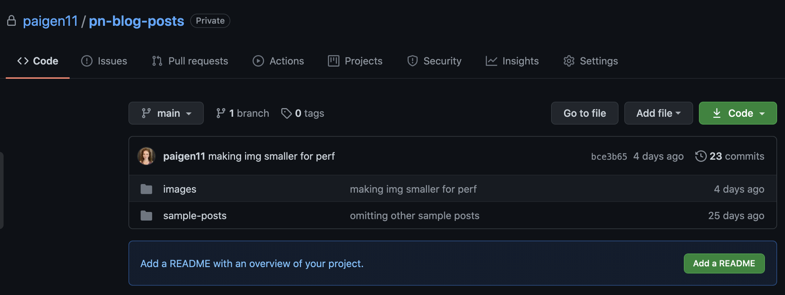
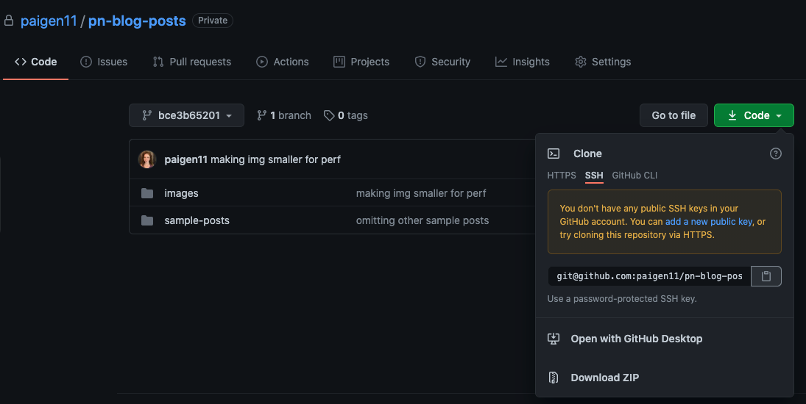

## How to Utilize Submodules within Git Repos
> One Solution When the Primary Code Can be Open Source, but Specific Content Needs to be Private

### Helpful links

- Relevant chapter in GIT-SCM book: Git submodules
- [This article](https://blog.bitsrc.io/how-to-utilize-submodules-within-git-repos-5dfdd1c62d09)

### Intro

Imagine, if you will, a scenario where you want to share the majority of a code base with everyone,
but perhaps, keep one folder within that codebase private. I encountered this very scenario when
building my [personal website](https://paigeniedringhaus.com). I used a popular, albeit barebones,
[Gatsby starter site](https://www.gatsbyjs.com/starters/Vagr9K/gatsby-advanced-starter) to build it,
which I’m happy to share the source code for (the styling, the colors, the React components and
structure — have at it, no trade secrets there).  However, my site also houses my [personal articles
on web development and technology](https://paigeniedringhaus.com/blog), and I’d rather not make it
so easy that anyone could fork my whole repo, deploy it live, and have all of the articles I’ve put
the time and effort into creating under their own name on a copycat site (it sounds a little
ridiculous to think this would happen so blatantly, but I assure you, it’s not as far-fetched as it
seems).  And so, meet Git submodules, a way to have the best of both worlds: the public repo with
the [source code](https://www.gatsbyjs.com/starters/Vagr9K/gatsby-advanced-starter) anyone can see,
and inside of it, a private repo with the protected information only specific people can access.
Essentially, Git submodules are a way to have two or more repos work together as a single unit. One
project (or more), entirely separate from, yet used within, another project.  It is true the same
can be achieved by authoring [independent
components](https://harmony-docs.bit.dev/components/overview) and composing them together using
[Bit](https://harmony-docs.bit.dev/introduction/getting-started) (with some components exported to a
[private remote scope](https://harmony-docs.bit.dev/scope/set-up-remote-scope) and others to a
[public remote scope](https://harmony-docs.bit.dev/scope/set-up-remote-scope)) but I guess that’s
more of a matter of preferred methodology than anything else.

### Enter Git Submodules

#### Create a Submodule (Another repo)

1. Create the repo to be imported into the other project (the submodule). In my case, I created a
repo in GitHub I named pn-blog-posts. 
2. After creating, set it to private (if applicable to you), add any content and folder structures
you want and you should be almost done with this step.
3. Copy the URL of the repo in GitHub — you’ll need it in the next step when the submodule is added
to the main project.

Here’s a screenshot of what my submodule repo looks like, it’s currently very simple: an `images/`
folder, a `samplePosts/` folder and (eventually) a `posts/` folder will be included too.



#### Add a Submodule to an Existing Repo

Before doing anything with submodules, I recommend running this command to update the config and set
[submodule.recurse](https://git-scm.com/docs/git-config#Documentation/git-config.txt-submodulerecurse)
to true, which allows git clone and git pull to automatically update submodules.

```
git config --global submodule.recurse true
```

If you neglected to do this when initially adding the repo, it’s OK, you can later run the command
below, and it will initialize, fetch and checkout any nested submodules for you:

```
git submodule update --init --recursive
```

Right, the main project should be ready, so let’s add that submodule.

#### `add submodule`` Command

> __DON'T COPY `.gitmodules` FROM A REFERENCE PROJECT. ADD IT VIA `GIT-SUBMODULE-ADD` !!!__

To add a new submodule to an existing project, you’ll open the project up and use the following
command in the terminal:

```
git submodule add -b [branch] [URL of project to add in GitHub] [name of directory you want to see in the project]
```

By default, submodules will add the subproject into a directory named the same as the repository.
You can add a different path at the end of the command if you want it to go elsewhere (also remove
the brackets, I added those to make it easier to see the different parts of the git command).

Make sure to mention the `protected` branch name, as some projects have `master` and some `main`, as 
protected branch. Example in my project:

```
git submodule add -b %master/main% https://github.com/paigen11/pn-blog-posts content 
```

At this point, there should be a new folder present in the project named `content/` and if you run git
status in the command line, there should be a couple of new files present. First is a `.gitmodules`
file, and second is a folder named `content/`.  Let’s take a closer look at these two new files.

## Git Submodules Configuration Files

### `.gitmodules`

Look inside `.gitmodules` file:

```
[submodule "content"]
path = content
url = https://github.com/paigen11/pn-blog-posts
branch = main
```

This is a configuration file that stores the mapping between the submodule project’s URL and the
local subdirectory you’ve pulled it into. If you have multiple submodules, you’ll have multiple
entries here with the name of each submodule and its URL. This is how other people, who clone this
project, know where to get the submodule projects from. The same holds true for deploying this
project somewhere not on your local machine (like Netlify, for instance), but we’ll get to that a
little later in this article.

### `.git/config`

The file will reflect submodules and their configuration, only after `git init` or `git update --init` are executed. Even if `.gitmodules` is set and the submodules are present in it, `./git/config` won't reflect it, till `init`/`update`.

### `.git/modules`

> No idea what it serves

## Committing a submodule

Run to see status (HEAD commit) of submodules:

```
git submodule status
```

Run to see files status, aka each submodule is a pointer to a specific commit:

```
git status
```

For example, the output will be a new project entry folder `content/`.  Although content is a subdirectory in 
your working directory, Git doesn’t track its contents when you’re not in
that directory. Instead, Git sees it, as particular commit from that repository. 
And when you run the commands:

```
git commit -am 'adding content submodule'
git push origin HEAD 
```

Your new submodule will be added to your GitHub project like the screenshot below:


When you click on the content [@COMMIT_SHA]() folder in GitHub, instead of being taken to a folder of
files inside of the main `paigeniedringhaus` repo, you’ll be linked over to the `pn-blog-posts` repo.
And since the repo is set to private, only those with access can see the contents of the repo; all
others will see a 404 page instead.

## Update the Contents of the Submodule

Let’s say, you’ve made some additions to the submodule repo, pushed it to the submodule project & merged a pull-request. Now, you’re ready to preview it and deploy it inside of your main project.
Next, open the main project locally and pull in the changes of the submodule by:

```
git submodule update --remote
```

With this command Git will go into your submodules folder and fetch any updates for you. If you
want to fetch updates for just one submodule in a project, just add the name of the submodule folder
after `--remote` to target it in particular. For updating `content/` submodule:

```
git submodule update --remote content
```

## Change the Branch the Submodule Updates From

The submodule update command will, by default, assume that you want to update the checkout to the
master branch of the submodule repository. If your changes are in another branch (like `main`), you
can set this in your `.gitmodules` file or just in the local `.git/config` file like so:

```
git config -f .gitmodules submodule.content.branch main
```

## Deploy to a Host with Private Submodules

Another thing I want to cover (because this tripped me up initially): how to authorize a cloud host
to access your private submodule when it tries to build and deploy your site.  I’ll be using
[Netlify](https://www.netlify.com/) as the example host because it is actually where I host my site,
and it’s a joy to work with.

## Cloning a Project with Submodules

Ok, the last thing I’ll talk about in this blog is cloning a project with submodules present.  When
you clone such a project, by default you get the directories that contain submodules, but none of
the files within them yet.  To download the submodules’ contents (files/dirs), you must run two commands: 

```
git clone <URL> 
```

```
git submodule update --init --recursive
```

Same goes regaring pulling changes:

```
git pull && git submodule update --init --recursive
```

After that, your submodules should be in exactly the same state as when you committed
them earlier.

# A Shortcut

Run the next command to clone & then initialize and update each submodule in the repository,
including nested submodules, if any of the submodules in the repository have submodules themselves.

```
%> git clone [repo URL from github] --recurse-submodules
```

Again, it’s kind of like cloning a repo from GitHub and then installing all the `node_modules` listed in 
the `package.json` locally. We do it so often as developers, we don’t even have to think too much about
it, and it’s nice to me, that submodules operate in a similar fashion.

## TROUBLESHOOTING

### Bug fix: __Error checking out submodules__

#### Problem

When I pushed my Gatsby project to Netlify for the first time, I got the following error during build time:

> __Error checking out submodules__: Submodule `content` (https://github.com/paigen11/pn-blog-posts)
> registered for path `content`Cloning into '/opt/build/repo/content'...fatal: could not read
> Username for 'https://github.com': No such device or addressfatal: clone of
> 'https://github.com/paigen11/pn-blog-posts' into submodule path '/opt/build/repo/content' failed
> Failed to clone `content`.

#### Solution from StackOverflow Solution

[failing-to-deploy-website-on-netlify-when-trying-to-use-alternate-hexo-theme](https://stackoverflow.com/questions/53625208/failing-to-deploy-website-on-netlify-when-trying-to-use-alternate-hexo-theme)
I found advised updating the `.gitmodules` URL to reference the submodule’s GitHub address as its
SSH address instead of the HTTPS address I’d initially used.  So I did. I went back to GitHub and
copied the SSH address for my private repo (which I’ve taken a screenshot of here for reference).

Notice the screenshot above shows me copying the SSH address for my private repo to replace the
original HTTPS address in my main project’s `.gitmodules` file.



Then, I updated the `.gitmodules` url as shown below in my main project.

```
[submodule "content"]
path = content
url = git@github.com:paigen11/pn-blog-posts.git
branch = main 
```

Notice, that now my URL is no longer the `https://github.com/paigen11/pn-blog-posts`, instead it’s
become `git@github.com:paigen11/pn-blog-posts.git`. I pushed to Netlify again, my project failed to
build again. But the error message this time led me to a Netlify Forum that cleared up what was
happening this time.  Since my submodule was set to private in GitHub, I needed to grant permissions
for Netlify to access the private submodule via SSH key.  I followed the Netlify instructions to
create a deploy key in GitHub and added the key to my private repo as a read-only key (you can
find this setting in a repo at `github.com/github-username/repo-name/settings/keys`).


And I pushed it to Netlify to build one more time and… voila! My site went live — submodules and
all!  Note: If my submodule repository had been public, I wouldn’t have needed to update my
`.gitmodules` file and add the SSH key, but since it was private, I had to. If the submodule you
link to is public, you should be fine deploying with no changes at all to those files.

### Messed Up Submodules Configuration

#### Problem: Cannot pull changes

After changing a link to an submodule IP Project, Git doesn't pull fresh files from the new repo.

### Solution: Clean Up Your Repo Submodules Configs

```
git submodule deinit -f --all
```

```
rm -rf .git/modules/*
```

```
git submodule update --init --recursive
```