# [Running Questasim on any OS through Docker](https://blog.reds.ch/?p=551)


>September 12, 2018\
>**Rick Wertenbroek**

## Questasim

When doing HDL simulation Questasim is one of our main tools. However it only runs on Windows and GNU/Linux. Although we  mostly use GNU/Linux machines Questasim is not compatible with all distributions. This mainly because of library version compatibility, albeit this being fixable, it is a pain to do (find out which library is the culprit and which version is needed).

So creating a Docker image seems like a good solution. It provides a known fixed environment to Questasim and allows us to run it on any machine.

Note : Questasim 10.5c is used here, but the process should be very similar for other versions 10.xx

### Generating the install script

Questasim has a graphical installer (based on java) but it also provides a tool to generate a batch install script. Let’s do this. Launch the graphical installer and choose the “Batch Tool” option.

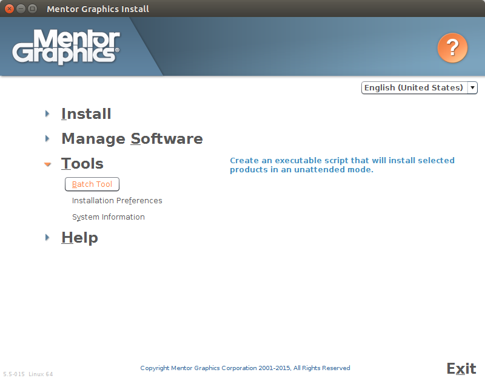

When prompted choose the path to the installer executable

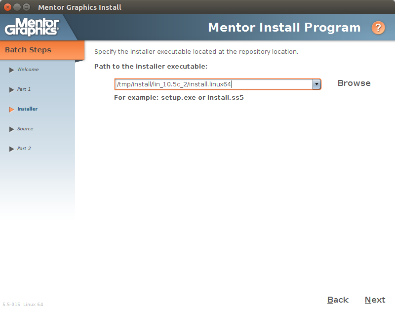

It should find the associated products you want to install

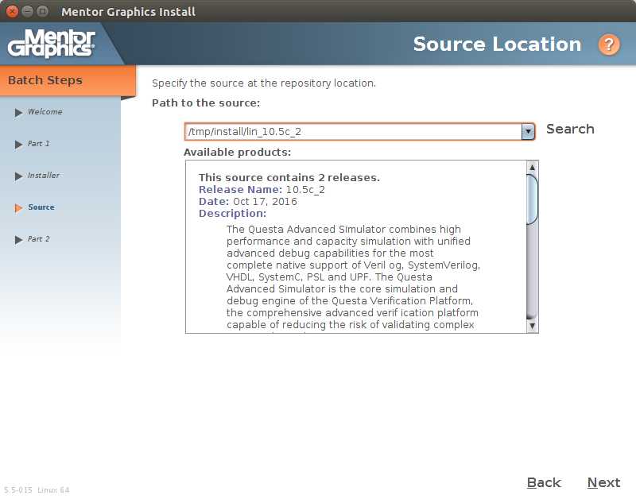

Choose the path for the installation on the client machines (our Docker image), we use /opt/eda/mgc but any path will do.

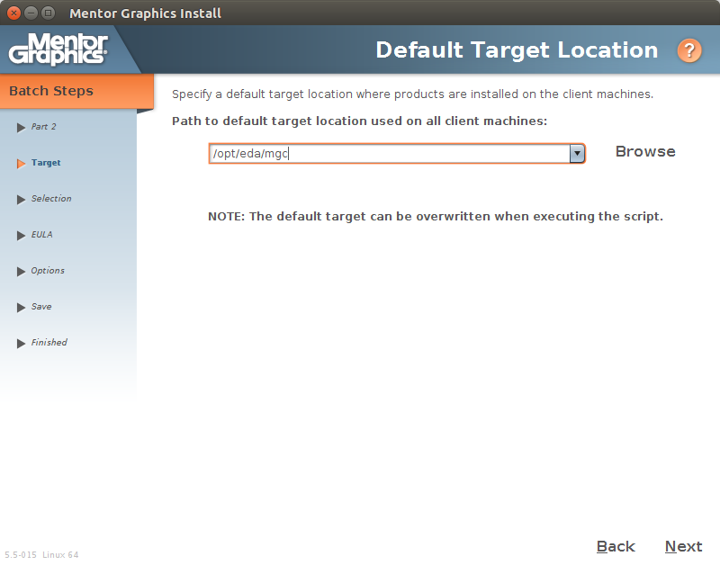

Select the products you want to install

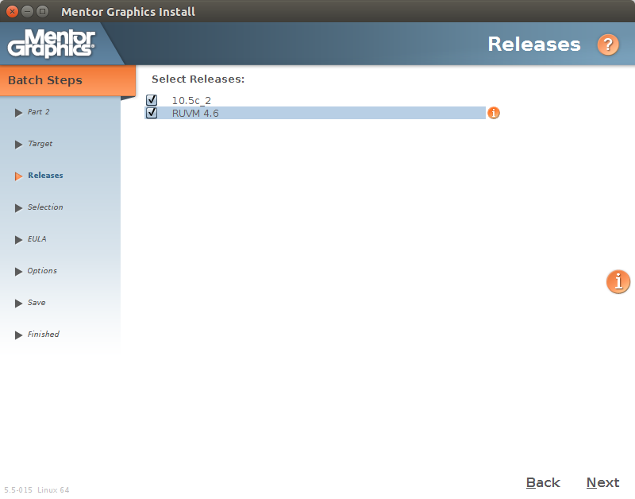

Select Linux Redhat Entreprise Linux 5/6 as the operating system.

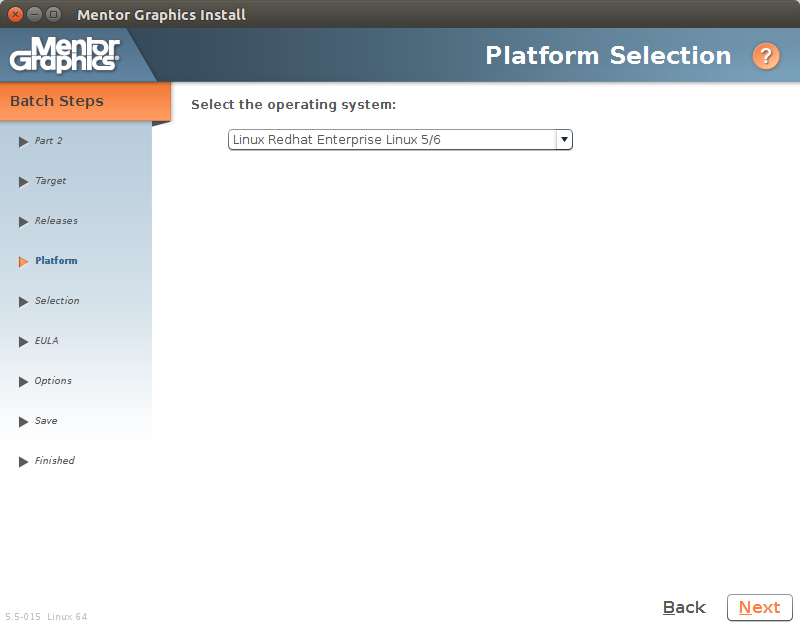

Select all products you want to install.

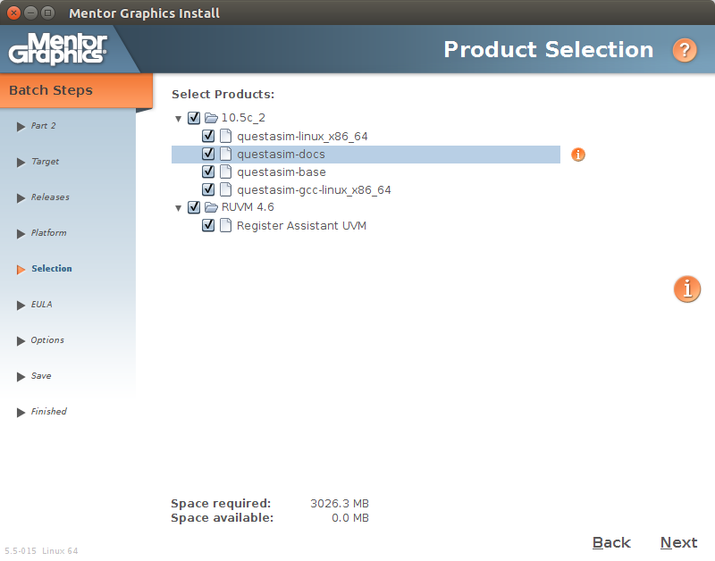

Agree with the license.

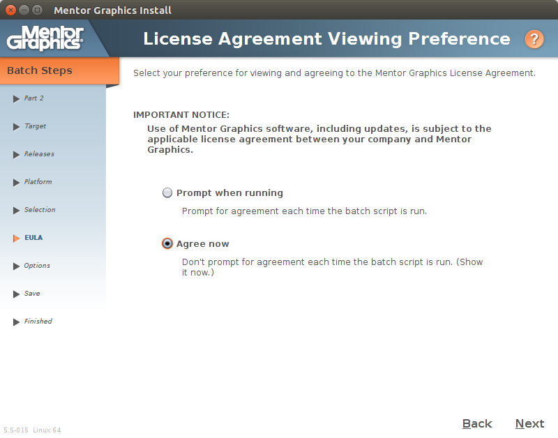

There is no need for the verbose mode during installation, I checked verify to verify the integrity of the files after installation but this can be omitted and you can keep the log file if needed.

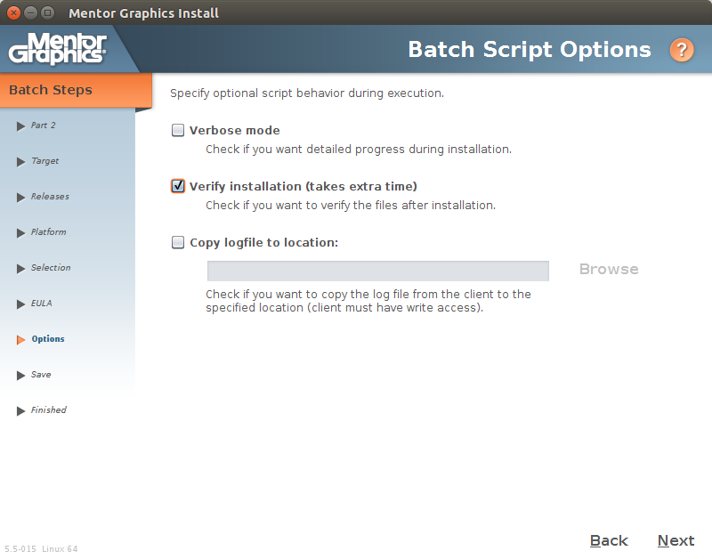

Choose a path to save the batch installation script **batchinstall.sh**

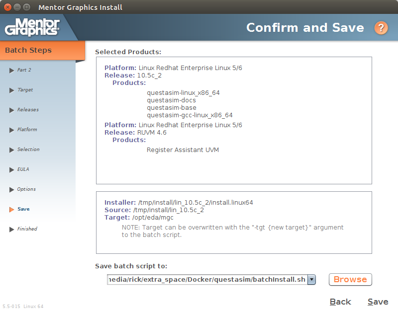

You now possess a script to install Questasim without going through the GUI.

### Creating the Dockerfile

I chose ubuntu 16.04 as a base for this machine since I had good results with Questasim on that particular version. (Newer versions required fumbling with libraries to make it work).

Be careful with spaces in the installation paths since they make your life much harder and even when surrounded with double quotes they may cause problems in subscripts such as the Questasim installer.

```Dockerfile
FROM ubuntu:16.04
 
RUN  apt-get update && \
     apt-get install -y --no-install-recommends \
     python \
     perl \
     libxft2 \
     libxext6 \
     ksh \
     && rm -rf /var/lib/apt/lists/*
 
COPY lin_10.5c_2 /tmp/install/lin_10.5c_2/
 
COPY ["batchInstall.sh", "/tmp/install/lin_10.5c_2/"]
 
RUN mkdir -p /usr/tmp && \
    /tmp/install/lin_10.5c_2/batchInstall.sh && \
    rm -rf /tmp/install

ENV PATH="/opt/eda/mgc/questasim/linux_x86_64/:${PATH}"
 
ENV LM_LICENSE_FILE=xxxx@server
 
CMD ["/opt/eda/mgc/questasim/linux_x86_64/vsim"]
```

The Dockerfile installs the needed libraries and software, then copies the installation folder and the installation script. Once this is done the install script is launched and Questasim is being installed, when this is done the installation folder is removed.

>Note : It is also possible to simply copy an existing installation of Questasim from another machine, this will work too but is a bit dirty.

### Building the Docker image

From the directory with your Dockerfile you can build it with the following command :

```bash
docker build -t questasim:10.5c .
```

You should have a directory `lin_10.5c_2` with the Questasim installer and .mis files in the same directory (else adapt your `Dockerfile`) and the `batchinstall.sh` file, we generated, see the tree below.

```bash
.
├── batchInstall.sh
├── Dockerfile
└── lin_10.5c_2
    ├── install.linux64
    ├── questasim-base.mis
    ├── questasim-docs.mis
    ├── questasim-gcc-linux_x86_64.mis
    ├── questasim-linux_x86_64.mis
    └── regassistuvm_4.6_ixl.mis
```

Wait for the installation to finish… this can take a few minutes

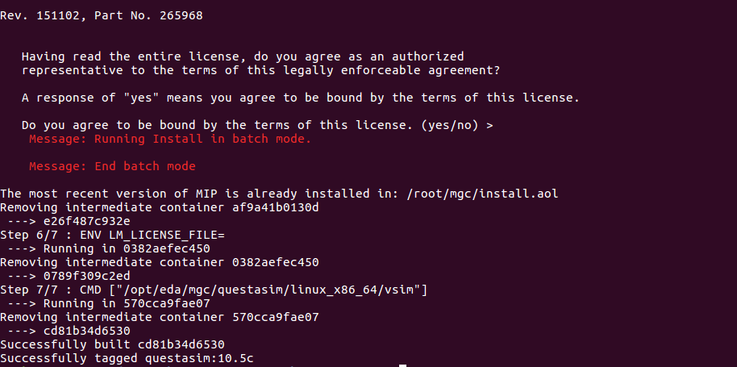

It is good to have a `.dockerignore` file to avoid copying unnecessary data to the Docker deamon. Mine has the following content:

```bash
*
!lin_10.5c_2
!batchInstall.sh
```

It is a whitelist, I block everything except the files marked with a bang !

### Running Questasim through Docker

Now that everything is installed and the image ready you can run Questasim with the following command.

```bash
docker run --net=host --env="DISPLAY" --volume="$HOME/.Xauthority:/root/.Xauthority:ro" --rm -it questasim:10.5c
```


And voilà ! Questasim is running through Docker. (Depending on your X11 config you may need to accept connections, you can add them with the xhost utility program).

Let’s see what our command does and how to share files with the Docker instances :

```bash
docker run --net=host --env="DISPLAY" --volume="$HOME/.Xauthority:/root/.Xauthority:ro" --rm -it questasim:10.5c
```

The `–net=host` option is to connect to local ports/services, this is required to share the connection with the X11 windows server, we also need to share the DISPLAY environment variable and the `.Xauthority` file (`ro` == read only).  
I like the `--rm` option, it will delete the container once exited (to save space, don’t worry the image remains)

We can add a volume to share data between Questasim and the host. Here I added `~/projects/hdl/verification/examples` and mapped it to `/input` in the Docker container.

>Note, the added `-u ${UID}:$GID` or `id -u/-g $USER` option, this is to change the `user ID (aka UID)` and `group ID (aka GID)`, so that it matches the user on the host system, since Questasim can write in the shared volume we don’t wan’t it to write as user **root** but rather as the same user that launches the docker instance on the host.

```bash
docker run -u `id -u $USER`:`id -g $USER` --net=host --env="DISPLAY" --volume="$HOME/.Xauthority:/root/.Xauthority:ro" --volume="$HOME/projects/hdl/verification/examples:/input" --rm -it questasim:10.5c
```

Now, I can run a simulation...

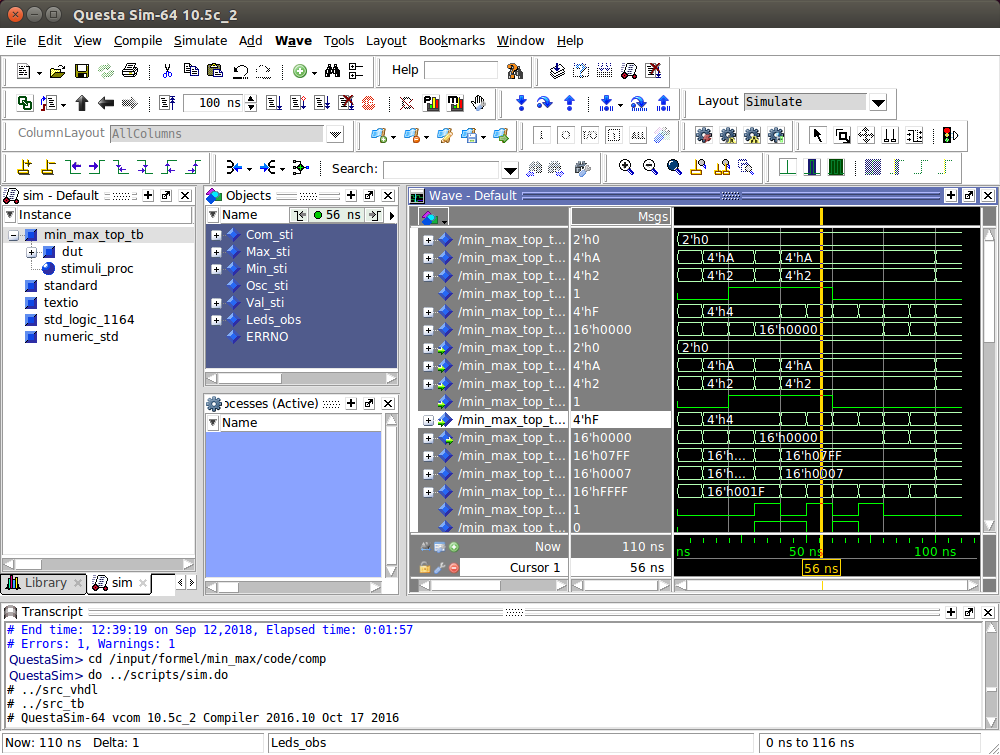

### “Exporting” (saving) the Docker image

We can save the image directly to share it with other computers without the need of installing again.

```bash
docker save questasim | gzip > questasim_10.5.tar.gz
```

This command will take quite some time, especially if you installed a full questasim with UVM and everything since the resulting image will be around **4.6GB**. The resulting archive will be around **2.3GB** (gzipped)

## Running Questasim on Windows

I did not try this docker image on Windows but it should work the same once you have a X11 server installed.

## Benefits over native or virtual machines

### Vs native

The major pros are keeping your machine clean, no junk installed, once you remove the Docker image your computer is as clean as it was before, when you install the software natively there is often junk left behind even after an uninstall.

Another pro is that an update of your OS will not break the Docker encapsulated software, as it would have done if installed natively (e.g., going from `Ubuntu 16.04` to `17` or `18.04` will break Questasim and require you to install specific libraries).

A con could be the extra layer slowing down the execution (this is very minor with Docker, you don’t have to run an entire OS as with a VM). I did not fell any major slowdown. I should benchmark Vivado synthesis on a Docker image, but from the tests I’ve done it runs almost as fast and can use multiple processor cores as with the native installation.

### Vs virtual machines

Virtual machines take a ton of space due to the installation of the entire OS you are running the software on. So your Docker image doesn’t eat so much of your space.

Virtual Machines can become unstable over time, since the same immutable Docker image is instanciated when launching a container you don’t have this possible unstability over time.

Plus the docker image is only used for one software so there is no harmful interaction possible between your software and other software, or library upgrades that break you program.

## Conclusion

As hardware engineers we don’t always keep up with the latest virtualization technologies and OS independent tools, however we should. Docker is a nice way to make os dependent tools os independent. This also keeps things confined and is easy to install or remove (docker load / docker image rm). A possible improvement on the steps above would be to encapsule the steps needed to launch the software in a executable script.