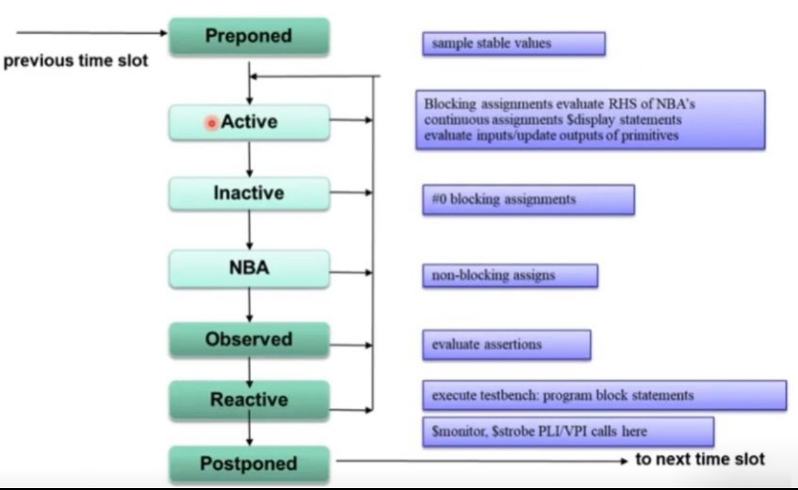

### SV Event Scheduler

To avoid race conditions SV has introduced new regions like preponed, observed, reactive and postponed.

- Preponed: stores values of variables in the previous time slot to be evaluated in Observed by concurrent SVA.
- Active: introduces module-block & interface-block fot RTL code execution.
- Observed: evaluates immediate & concurrent SVA.
- Reactive: introduces program-block for test-bench (aka TB) code execution.
- Postponed: actives $strobe(), $monitor(), final-blocks, __in some tools__, coverage-collection & other PLI.

### Sub Region Classification

Active & Reactive region are classified into 3 types:

1. Active/Re-Active sub-region executes:
    - Initial Blocks
    - Blocking Assignments (aka BA)
    - Evaluates RHS of NBA, but doesn't assign it to LHS.
    - Continuous Assignments, $display()
2. Inactive/Re-Inactive sub-region
    - #0 Assignments (not recommended, unless a work-around)
3. Non-Blocking Assignment (aka NBA)/Re-NBA sub-region
    - Assignments of RHS, evaluated in Active/Re-Active to LHS

A division to Active & Re-Active region is a SystemVerilog enhancement over old Verilog and it allows a separation of TB events from RTL events.